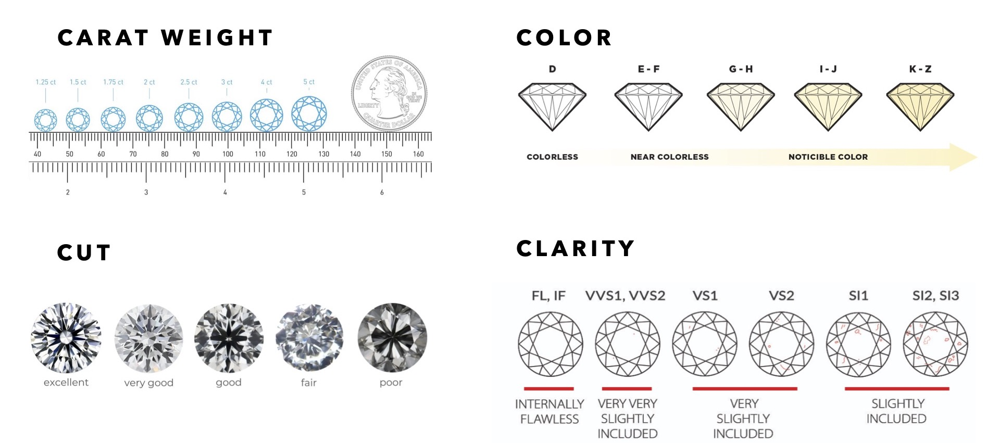
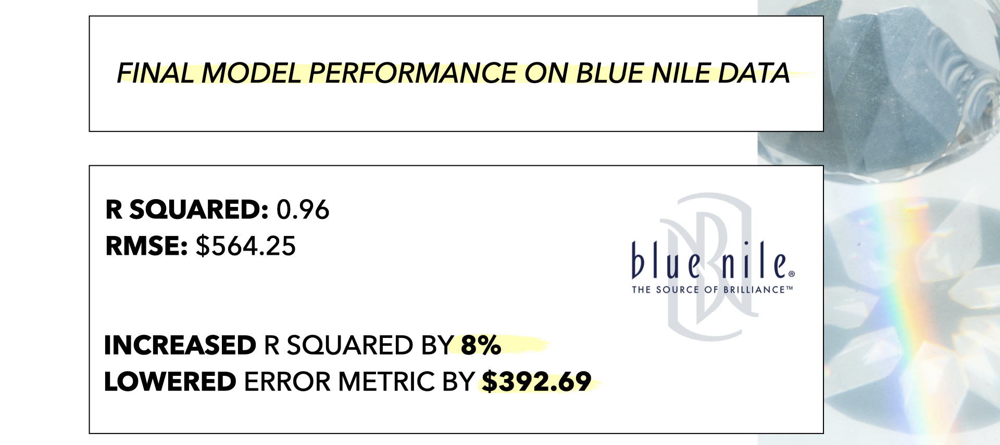
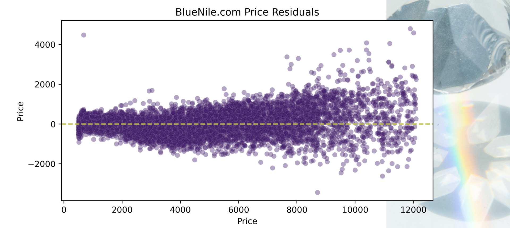
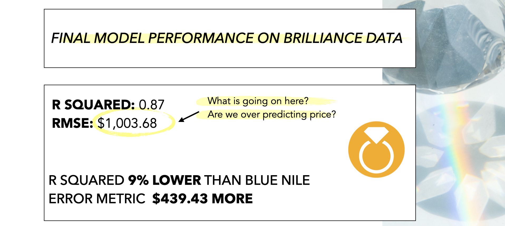
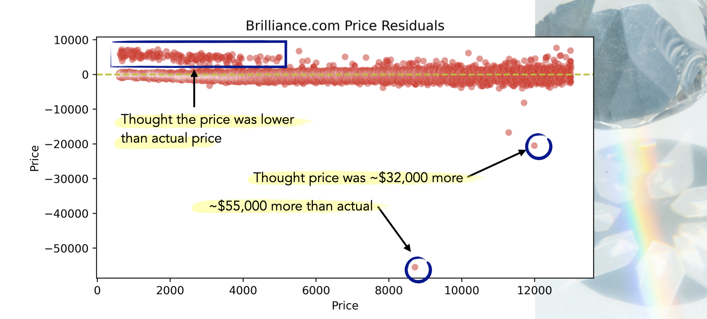
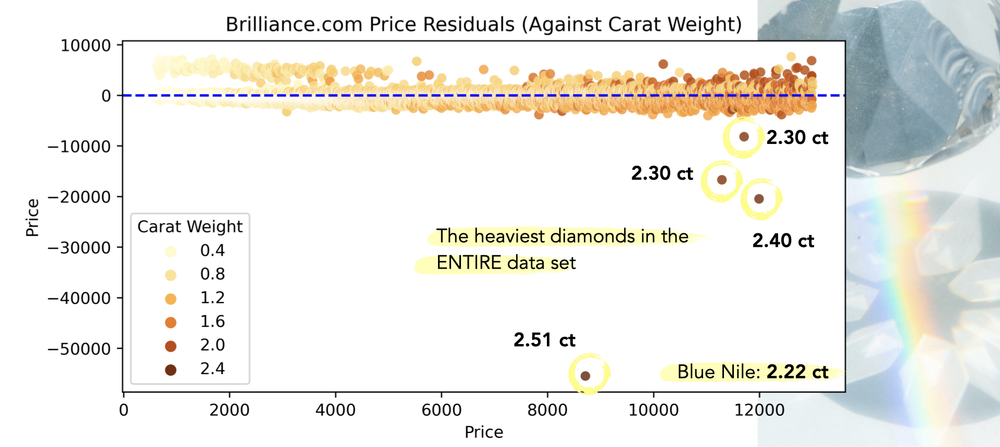

# **IS YOUR WHOLESALE DIAMOND ACTUALLY A GREAT DEAL?**
Leslie Cardone  
April 16, 2021  
Metis: Webscraping and Linear Regression

## ABSTRACT

In 2017 it seemed that many of my friends and colleagues were getting engaged. The centerpieces surrounding these engagement announcements were the sparkling diamond rings proudly displayed on the fingers of each bride-to-be. 

Scrolling through picture after picture of smiling faces and pretty diamonds on my social feeds, I wondered: What exactly determined the price of a diamond? Is there such thing as a "great deal" when it comes to buying a diamond? 

The goal of this project is to collect loose diamond data, build a highly predictive linear regression model or linear regression model variation, and apply that model across diamond data from two separate websites. 

I hypothesized that my model would perform poorly and consistently over-price the loose diamonds for sale on the wholesaler website, after all these diamonds are advertised as having unbeatably low prices.

## DATA

The two websites I scraped data from are from the retail store [Blue Nile](https://www.bluenile.com/diamond-search) and the wholesaler [Brilliance](https://www.brilliance.com/diamond-search). Brilliance came up in my Google search for 'wholesale loose diamonds' and their website contains strong advertising for special deals and discount prices.

I was able to collect 52,372 samples from Blue Nile and 21,782 samples from Brilliance. All samples were round GIA (Gemological Institute of America) graded diamonds within the $500 - $13,000 price range.

I used 11 diamond features available on both websites in my initial multiple linear regression model:
carat, cut, color, clarity, polish, culet, table %, depth %, symmetry, length to width, and fluorescence.

## DIAMOND FEATURE GUIDE

**FEATURES** 
- **Carat**: the diamond's weight    
- **Cut:** how well proportioned the diamonds dimensions are
- **Color:** absence of color to light brown, the larger the carat the more visible the color
- **Clarity:** assessment of small imperfections on the surface and within the stone
- **Polish:** how smoothly the diamond has been polished and how defined the edges are, if any marks are visible from polishing wheel
- **Culet:** the facet at the tip of a gemstone. The preferred culet is not visible, graded 'none.'
- **Table %:** the largest facet of a gemstone, the width expressed as a percentage of its average diameter 
- **Depth %:** the height of the gemstone measured from the culet to the table, divided by average girdle diameter
- **Symmetry:** the symmetry and alignment of a diamond's facets 
- **Length to Width**
- **Fluorescence:** measure of visible light some diamonds emit when exposed to UV rays

**TARGET**
- **Price:** $500 - $13,000
      

## DESIGN

I sacrificed interpretability in my model to create most predictive model I could within the linear regression framework. I added complexity by creating custom interaction terms, second degree polynomial terms for every feature, and all interactions terms. In the end I had 152 features.

I scaled all my features using the Standard Scalar and used a lasso regression with an alpha/lambda of 0.1. Only several of my features were minimized to zero.

I used a validation set for my feature engineering and hyper-parameter tuning. 

## MODEL SELECTION & METRICS
I divided the Blue Nile data into train, validate, and test sections. I trained my model on the train set while checking for overfitting with the validate set. My model never seemed to be at risk of overfit so I did not use Kfold Cross Validation. 

When I was happy with my model, I combined the Blue Nile train and validate sections into one section. I then fit my final model on those two sections.

In the very end, I applied my model to the Blue Nile test set and the Brilliance data set. I had held out both these sets of data up until this point and I did not do any more tuning based on the feedback from these applications.

### Blue  Nile  

| Metric               | Dataset       | Score      |  
|----------------------|---------------|------------|
| R2                   | Final Train   | 0.9565     |
|                      | Test          | 0.9567     |
| RMSE                 | Final Train   | $570.77    |
|                      | Test          | $564.25    |

### Brilliance

| Metric               | Dataset       | Score      |  
|----------------------|---------------|------------|
| R2                   | Test          | 0.87       |
| RMSE                 | Test          | $1,003.68   |

## FINDINGS

The model performs well on the Brilliance data, and actually consistently over-prices a group of loose diamonds in the $500 to $5,000 range. There are a few points where the model really over-estimated the price. Upon further investigation, these few data points had the highest carat weight across the entire data set. The model had never seen this weight before.

## FUTURE

I am planning to clean up these "outliers" from the dataset and rescore my model.

I would also like to increase the price range of the diamonds to see how the model would perform. There are fewer diamonds in the higher price range and based on the residual plot for the Blue Nile test data, the error increases as the diamond price increases. I would like to investigate to what extent this occurs.
