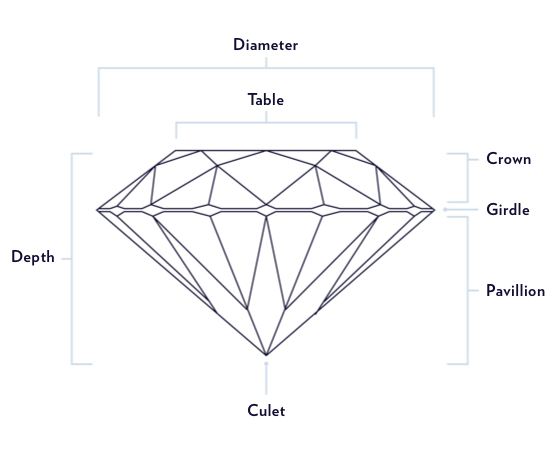
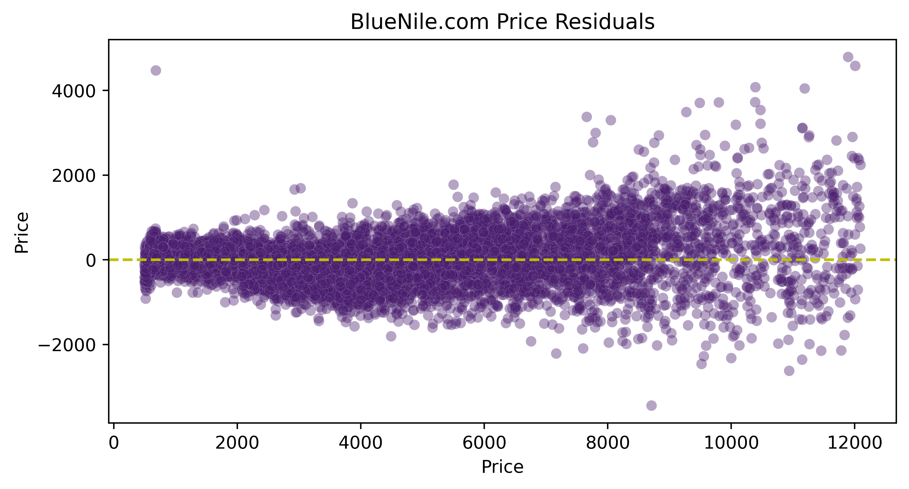
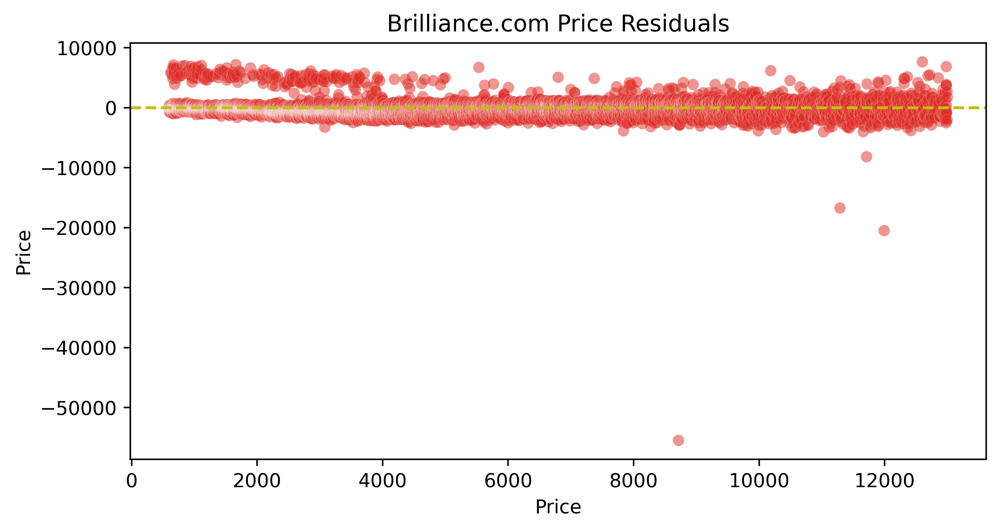
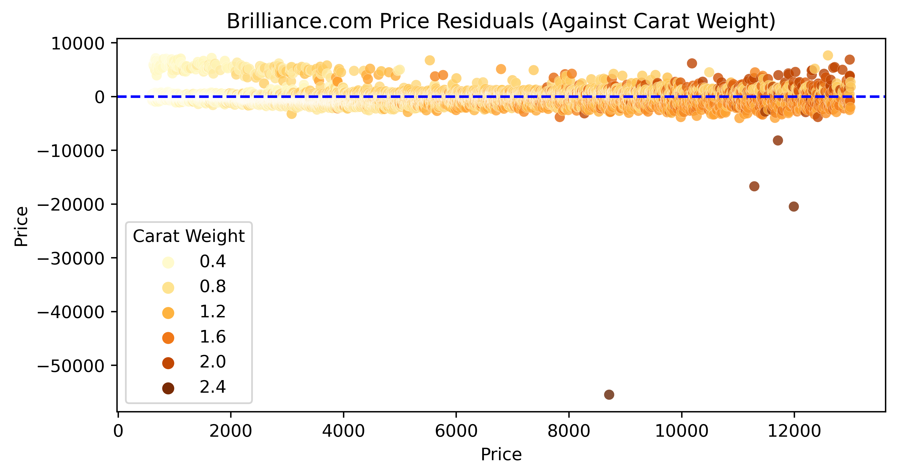

# **PREDICTING THE PRICE OF LOOSE DIAMONDS WITH LINEAR REGRESSION**
Leslie Cardone  
April 16, 2021  
Metis: Webscraping and Linear Regression

## ABSTRACT

The goal of this project is to collect loose diamond data, build a highly predictive linear regression model or linear regression model variation, and apply that model across data from two separate websites. 

I trained and fit my model to the data collected from the retailer Blue Nile and applied the model to the data collected from 'wholesaler' Brilliance.

I hypothesized that my model would perform poorly and consistently over-price the loose diamonds for sale on the Brilliance website.

## DATA

The two websites I scraped data from are [Blue Nile](https://www.bluenile.com/diamond-search) and [Brilliance](https://www.brilliance.com/diamond-search). Brilliance came up in my Google search for 'wholesale loose diamonds' and their websites advertises significant deals for their diamonds.

I was able to 'scrape' 52,372 samples from Blue Nile and 21,782 samples from Brilliance. All samples were round GIA (Gemological Institute of America) graded diamonds within the 500 - 13,000 price range.

I used 11 diamond features available on both websites in my initial multiple linear regression model:
carat, cut, color, clarity, polish, culet, table %, depth %, symmetry, length to width, and fluorescence.

#### Carat: the diamond's weight    
#### Cut: how well proportioned the diamonds dimensions are
#### Color: absence of color to light brown, the larger the carat the more visible the color
#### Clarity: assessment of small imperfections on the surface and within the stone
#### Polish: how smoothly the diamond has been polished and how defined the edges are, if any marks are visible from polishing wheel
#### Culet: the facet at the tip of a gemstone. The preferred culet is not visible, graded 'none'
#### Table %: the largest facet of a gemstone, the width expressed as a percentage of its average diameter
#### Depth %: the height of the gemstone measured from the culet to the table, divided by average girdle diameter
#### Symmetry: the symmetry and alignment of a diamond's facets    
#### Length to Width: length divided by width
#### Fluorescence: measure of visible light some diamonds emit when exposed to UV rays
   

  
### TARGET: Price

## DESIGN

I sacrificed interpretability in my model to create most predictive model I could within the linear regression framework. I added complexity by creating custom interaction terms, second degree polynomial terms for every feature, and all interactions terms. In the end I had 152 features.

I scaled all my features using the Standard Scalar and used a lasso regression with an alpha/lambda of 0.1. Only several of my features were minimized to zero.

I used a validation set for my feature engineering and hyper-parameter tuning. 

## ALGORITHMS/TOOLS

*LIBRARIES*
- Selenium and Beautifulsoup for webscraping
- Numpy and Pandas for data manipulation
- Matplotlib and Seaborn for plotting
- Scikit-learn for preprocessing, model selection, and metrics

*MODEL SELECTION*  
I divided the Blue Nile data into train, validate, and test sections. I trained my model on the train set while checking for overfitting with the validate set. My model never seemed to be at risk of overfit so I did not use Kfold Cross Validation. 

When I was happy with my model, I combined the Blue Nile train and validate sections into one section, which I will call "fit" because I then fit my final model on those two sections.

In the very end, I applied my model to the Blue Nile test set and the Brilliance data set. I had held out both these sets of data up until this point and I did not do any more tuning based on the feedback from these applications.

**Blue Nile Fit R2:** 0.9565233745272514  
**Blue Nile Test R2:** 0.9567486695562148  
**Brilliance R2:** 0.871143588969983  

**Blue Nile Fit RMSE:** 570.7690062960379  
**Blue Test RMSE:** 564.2497604260918  
**Brilliance RMSE:** 1003.6825133850317  

## COMMUNICATION
*VISUALIZATIONS*
1. Blue Nile Residuals for Test Data

2. Brilliance Residuals

The model performs well on the Brilliance data. There are a few points where the model really over-estimated the price. These few data points had the highest carat weight across the entire data set. The model had never seen this weight before.

3. Brilliance Residuals Color Coded by Carat Weight

