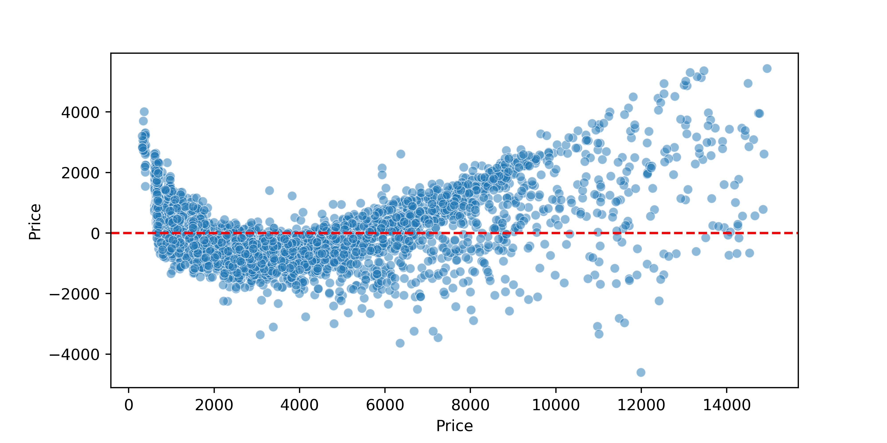
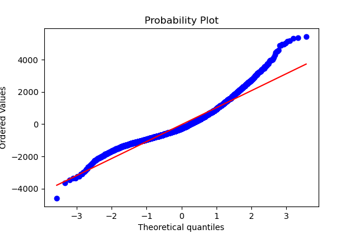
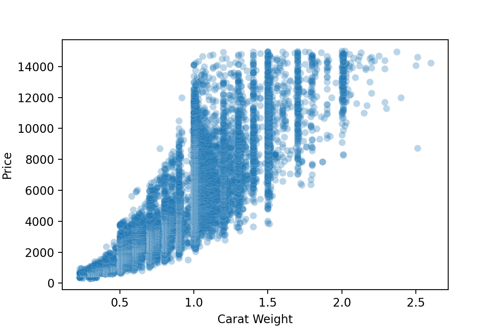

# Analysis of Wholesale Loose Diamond Prices

I trained a Scikit-learn Linear Regression model on 12 features to predict the price of *Brilliant.com* loose Diamonds in my validation set.

I plotted the residual errors of this Simple Multiple Linear Rregression model's predictions. As price increases, the model performs more poorly.

We see this again in the below probability plot, where where the distribution begins to stray from a Gaussian Distribution as the prices move further from the mean. 

This is my baseline, I plan to increase complexity by performing some feature engineering -- I need to create a polynomial term for the feature 'Carat'. I will most likely use the Polynomial Library to create some feature interaction.

I will also scale my data and use KFold Validation to to test if Ridge or Lasso Regression perform better than Standard Linear Regression. I suspect that there are some features that are not contributing in a significant way to the model.

Ultimately, I want to perform another Simple Multiple Linear Regression on another data set that I scraped from the web -- from the Diamond retailer Blue Nile. If I could have both models generalizing equally well, I'd like to feed both models features from the same test diamonds and see how the models differ in their predictions.
